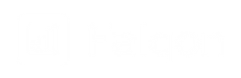

<h1 align="center"> Home Tab - Teste Técnico </h1>

<p align="center">
  Página desenvolvida para avaliação de teste técnico na empresa Falqon, criado e desenvolvido com Vanilla.JS
</p>

<p align="center">
  <a href="#-tecnologias">Tecnologias</a>&nbsp;&nbsp;&nbsp;|&nbsp;&nbsp;&nbsp;
  <a href="#-projeto">Projeto</a>&nbsp;&nbsp;&nbsp;|&nbsp;&nbsp;&nbsp;
  <a href="#-layout">Layout</a>&nbsp;&nbsp;&nbsp;|&nbsp;&nbsp;&nbsp;
  <a href="#memo-licença">Licença</a>
</p>

<p align="center">
  
</p>

<br>

<p align="center">
  
</p>

## 🚀 Tecnologias

Esse projeto foi desenvolvido com as seguintes tecnologias:

- HTML5, CSS3, JS ES6+
- [Node e Yarn](https://nodejs.org/)

## 💻 Projeto

Este projeto foi desenvolvido com a finalidade voltada para o teste de aptidões técnicas no processo seletivo da empresa Falqon, o teste é dirigido para a análise das habilidades com Adobe XD onde existe o layout para a criação da interface de usuário com HTML, CSS e JS Vanilla.

## 🏡 Comandos de execução no projeto

Instalação das dependências do projeto

```sh
yarn
```

Checar a escrita do código com ESLint e Prettier

```sh
yarn check
```

Formatar código

```sh
yarn write
```

## 🔖 Layout

<p align="center">
  
</p>

## 📝 Licença

Esse projeto está sob a licença MIT.

---
